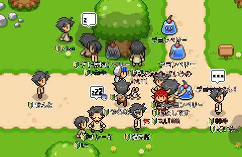
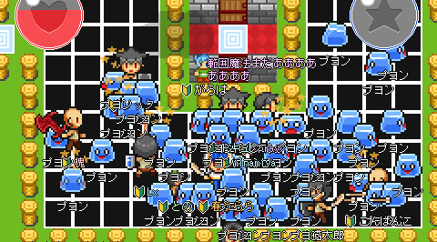
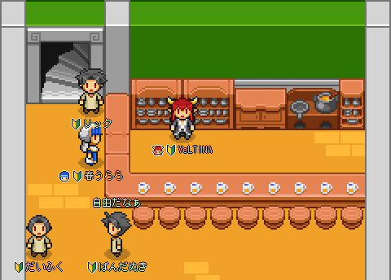
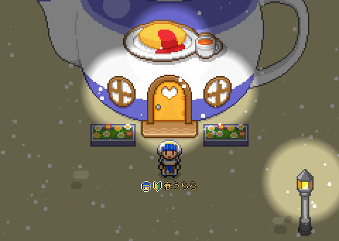

# スクラップブックオンライン ページ.2 (SBOP2)

個人制作の 2D MMORPG。2003年に始まった「スクラップブックオンライン (SBO)」の後継として2007年から開発を続け、Emscripten によってブラウザ上で動く Web 版が稼働しました。

  

  <a href="https://sbop2.urara-works.jp/">▶ ブラウザで遊ぶ</a>
  ・
  <a href="https://uraraworks.github.io/SBOP2/">🏠 紹介ページ</a>
  ・
  <a href="https://www.urara-works.jp/diary/sbop2/">📖 開発日記</a>

## スクリーンショット

|  |  |
|--|--|
|  町 |  戦闘 |
|  会話 |  インベントリ |

## 特徴

- **ブラウザで動く** — C++ で書かれたクライアントを Emscripten で WebAssembly 化。インストール不要でプレイできます。
- **20年以上の開発の歩み** — 2003年の初代 SBO から続く個人制作。2007年に「ページ.2」として全面刷新。
- **フルスクラッチ** — サーバー・クライアント・通信ライブラリまで自作。

## 技術構成

| 区分 | 内容 |
|------|------|
| 主要言語 | C++ (約79%) / C / JavaScript |
| クライアント | C++ + imgui。Emscripten で WebAssembly 化してブラウザで動作 |
| サーバー | 独自実装 (`SboSvr`) ＋ 独自ソケットライブラリ (`SboSockLib`) |
| Web 連携 | WebSocket ブリッジ (`WebSocketBridge`) |
| ビルド | Visual Studio ソリューション (`SBO.sln`) / `build.bat` |

## ディレクトリ構成

- `Common/` — 共通ライブラリ
- `SboSvr/` — サーバー実装
- `SboCli/` — クライアント（ゲーム本体）
- `SboSockLib/` — ソケット通信ライブラリ
- `WebSocketBridge/` — WebSocket 連携（Web 版用）
- `emscripten/` — Emscripten (WebAssembly) 対応
- `imgui/` — UI フレームワーク
- `SboCliAdminMfc/` — MFC 製の管理ツール
- `docs/` — 紹介ページ（GitHub Pages で公開）

## リンク

- 🎮 Web 版でプレイ: https://sbop2.urara-works.jp/
- 🏠 紹介ページ: https://uraraworks.github.io/SBOP2/
- 📖 開発日記アーカイブ（2007〜）: https://www.urara-works.jp/diary/sbop2/

## ライセンス

本プロジェクトは [GNU General Public License v3.0](LICENSE)（GPLv3）で公開しています。
自由に利用・改変・再配布できますが、**派生物も同じ GPLv3 で公開する必要があります**（コピーレフト）。

---

個人制作・技術検証を目的としたプロジェクトです。
