SBOP2 の世界にある場所とアイテムの一覧です。

操作方法は [[遊び方ガイド]] を見てください。

---

## マップ

### βマップ（冒険のはじまり）

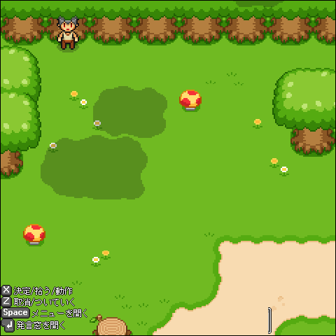

キャラクターを作ると、最初はここに立っています。
行き先: 始まりの町、農園

### フィールド

| 場所 | 行き先 |
|---|---|
| 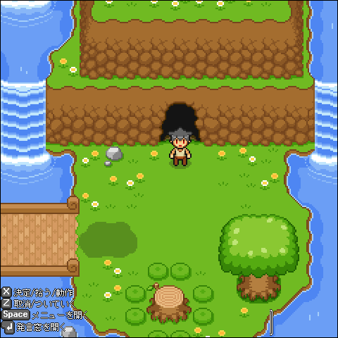 **始まりの丘** | 農園、祈り子の祠 |
| 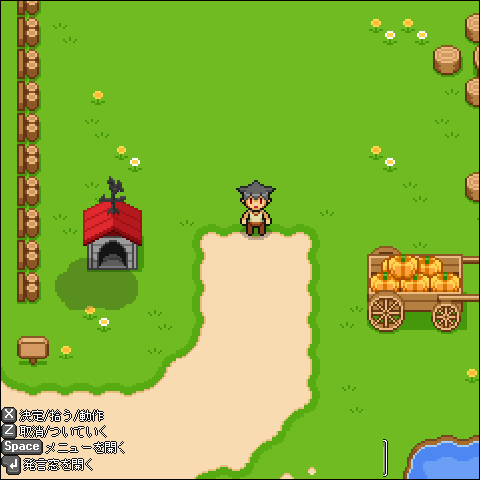 **農園** | βマップ、始まりの丘、農園の家 |
| 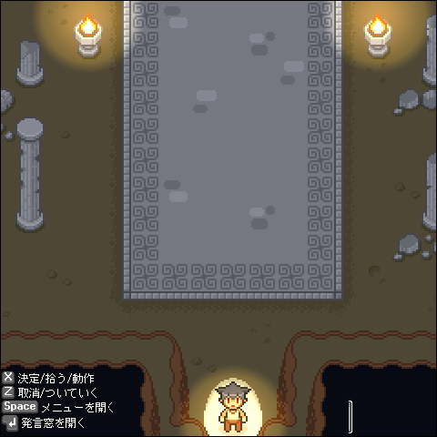 **祈り子の祠** | 始まりの丘 |
| 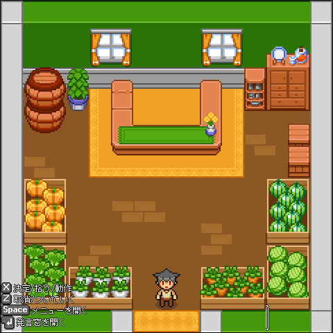 **農園の家** | 農園 |

### 始まりの町

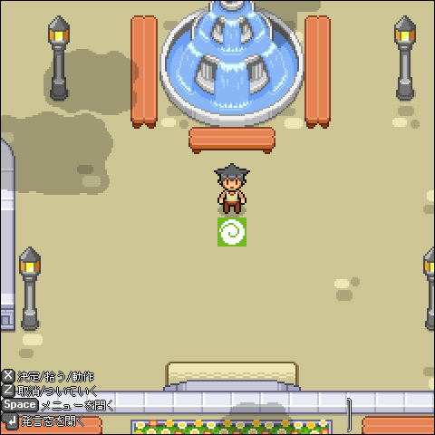

噴水のある広場を中心に、お店や施設が並ぶ町です。町は2つのマップに分かれています。

- 噴水の広場から入れる建物: 武器防具屋、雑貨屋、道場、カフェ、役所、教会、おしゃれ屋、バッジ屋

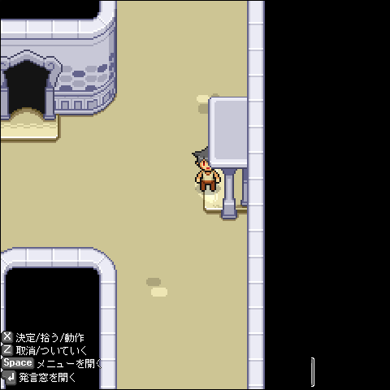

- もう一方のマップから入れる建物: 長老の家、バー、工房、預かり所、書店、食料品店、おしゃれ屋、バッジ屋、銭湯

### 町の建物

| 建物 | 中の様子 | 隣の部屋 |
|---|---|---|
| **武器防具屋** | 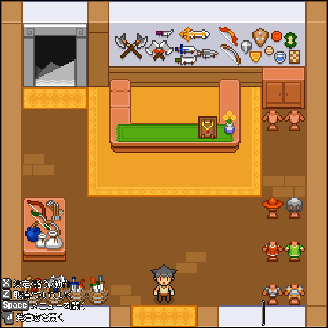 | 工房 |
| **工房** | 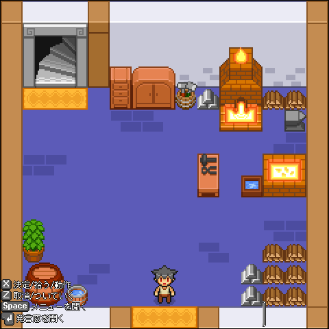 | 武器防具屋 |
| **雑貨屋** | 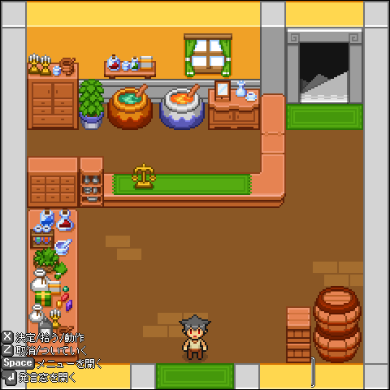 | 食料品店 |
| **食料品店** | 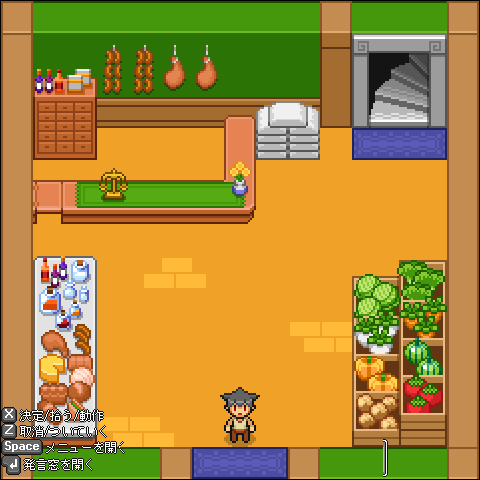 | 雑貨屋 |
| **道場** | 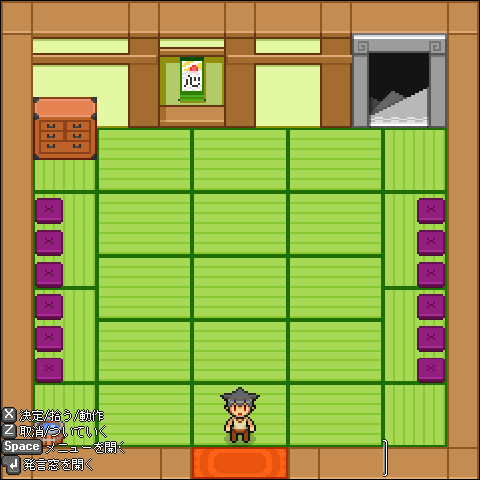 | 長老の家 |
| **長老の家** | 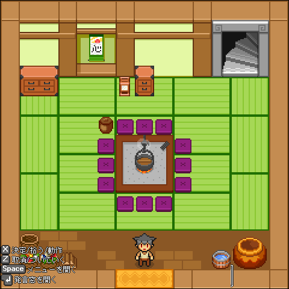 | 道場 |
| **カフェ** | 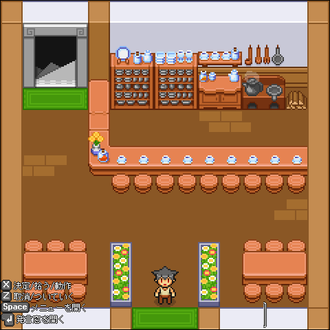 | バー |
| **バー** | 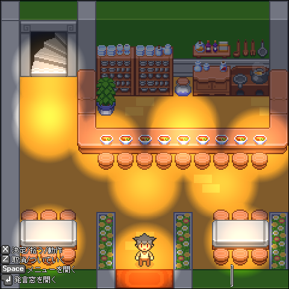 | カフェ |
| **役所** | 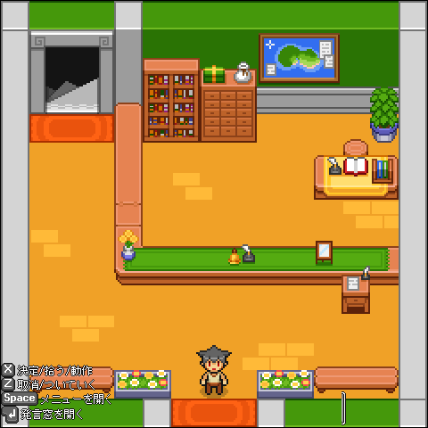 | 預かり所 |
| **預かり所** | 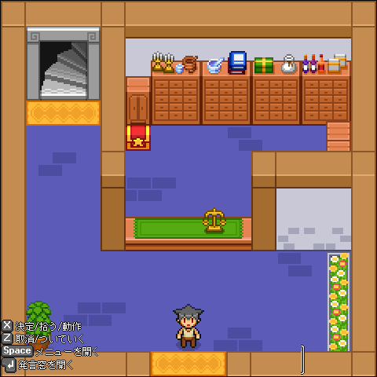 | 役所 |
| **教会** | 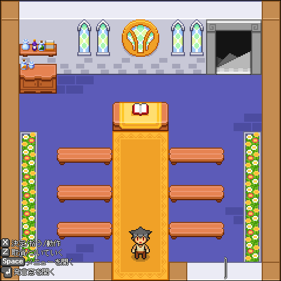 | 書店 |
| **書店** | 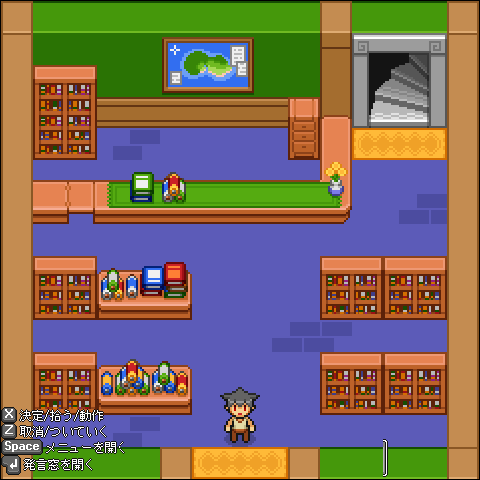 | 教会 |
| **おしゃれ屋** | 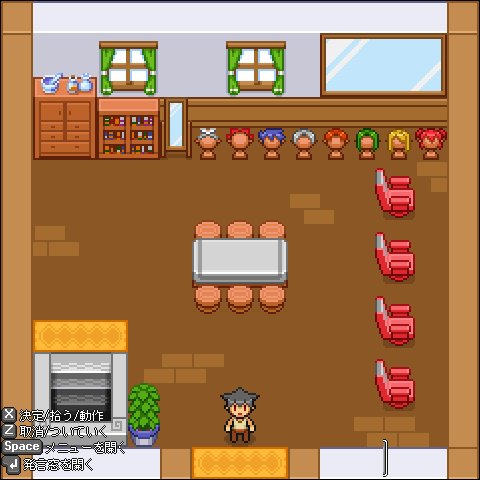 | |
| **バッジ屋** | 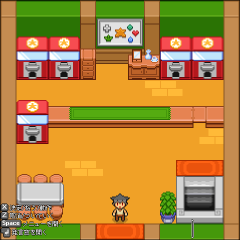 | |
| **銭湯** | 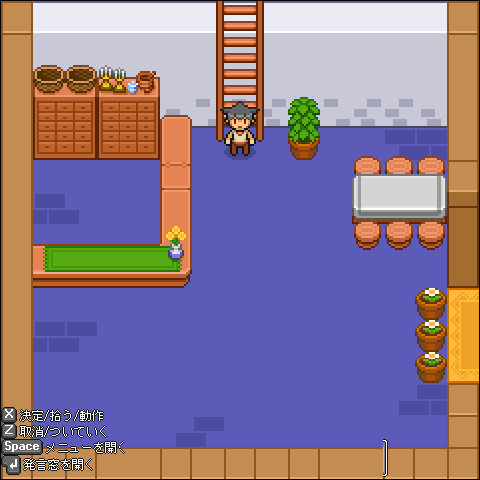 | 更衣室 |
| **更衣室** | 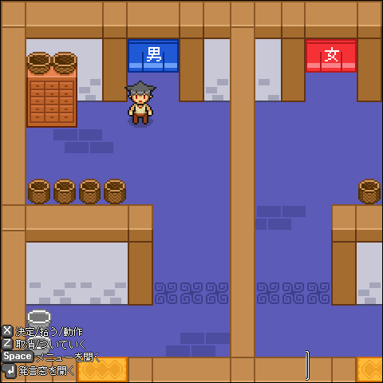 | 銭湯、大浴場 |
| **大浴場** | 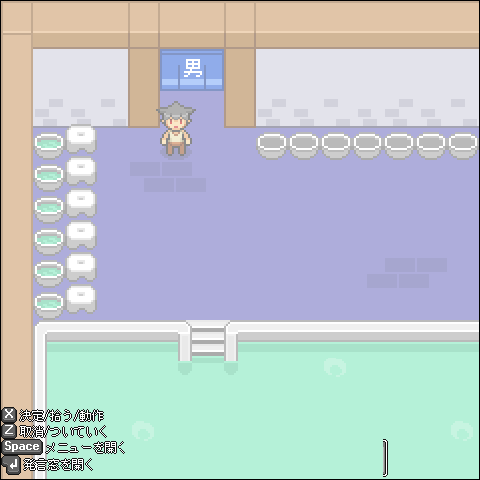 | 更衣室 |

「隣の部屋」は、町に出なくても中でつながっている部屋です。

---

## アイテム

### 武器・道具（手に持つもの）

| | 名前 | 武器の種類 | 攻撃力 |
|---|---|---|---|
| 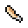 | 初心者用の木刀 | 斬る武器 | 1 |
| 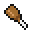 | 初心者用の棍棒 | 叩く武器 | 2 |
| 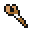 | 初心者用の杖 | 叩く武器 | 1 |
| 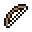 | 初心者用の弓 | 弓矢 | 1 |
|  | 魔剣ディアボロス | 斬る武器 | 12 |
| 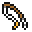 | 初心者の釣りざお | 釣り | - |

釣りざおは武器ではありません。装備している間は攻撃できず、水辺に向かって X で釣りをします。

### 盾

| | 名前 |
|---|---|
|  | 初心者用の盾 |
|  | 木の盾 |

### 服

| | 名前 |
|---|---|
| 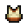 | 初心者用の服 |
| 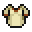 | 初心者用のローブ |

### 使うアイテム

| | 名前 | 効果 |
|---|---|---|
| 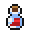 | 体力回復ポーション | HP が 5〜10 回復する（使うとなくなる） |
|  | プヨンゼリー | HP が 1〜10 回復する（使うとなくなる） |
|  | たいまつ | 60秒間、まわりを明るくする（使うとなくなる） |

### そのほか

| | 名前 | メモ |
|---|---|---|
| 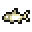 | イワナ | 魚 |
| 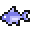 | アジ | 魚 |

---

このページの内容は、リポジトリに入っているゲームデータ（マップ・アイテムの定義）から作っています。
