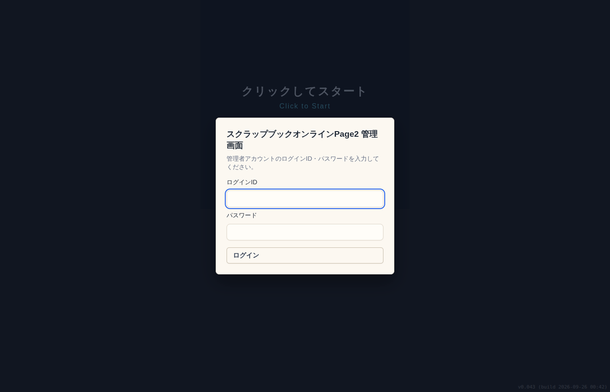
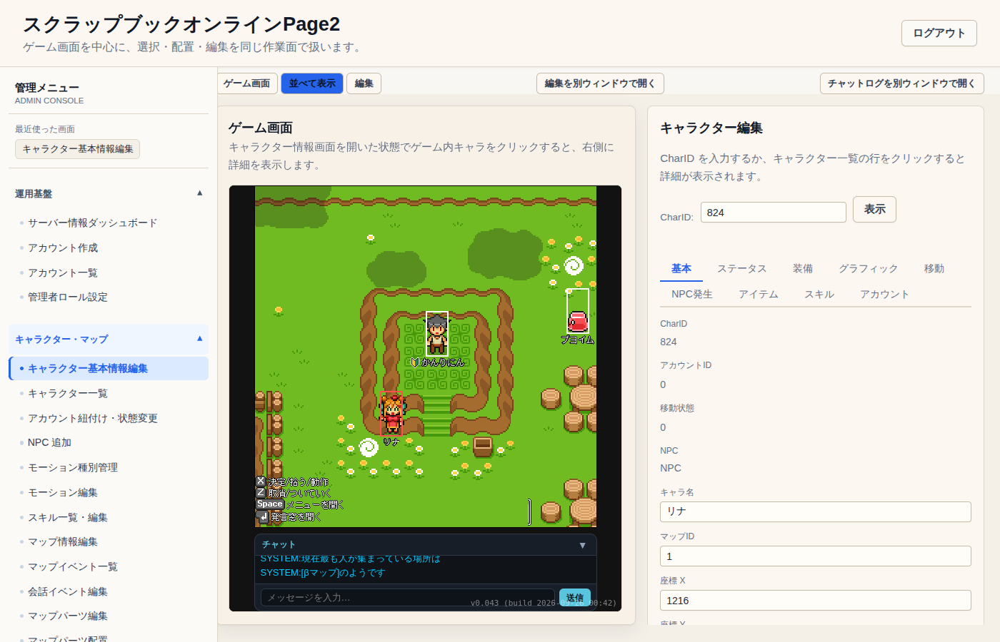
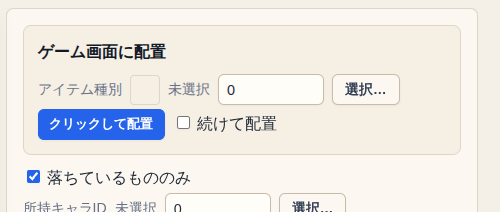
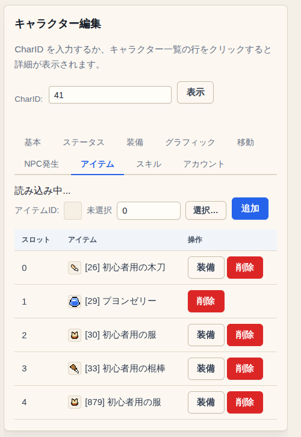
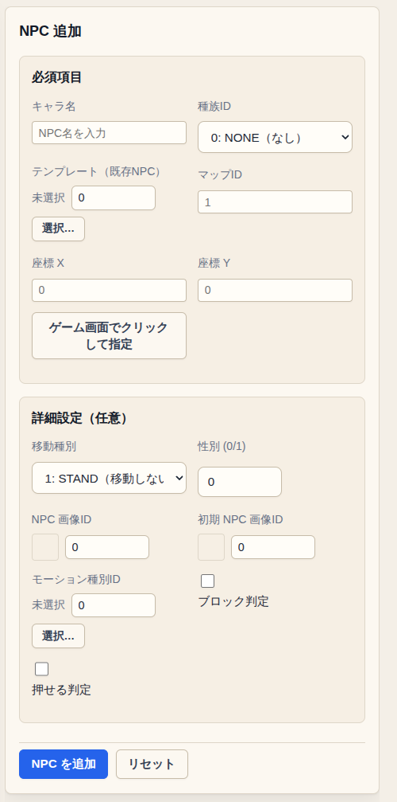
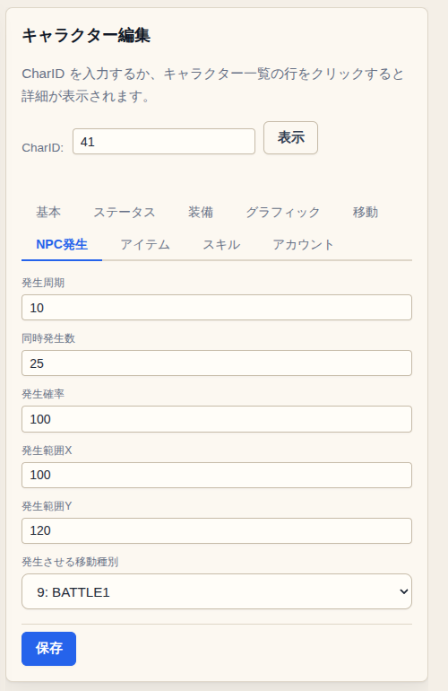
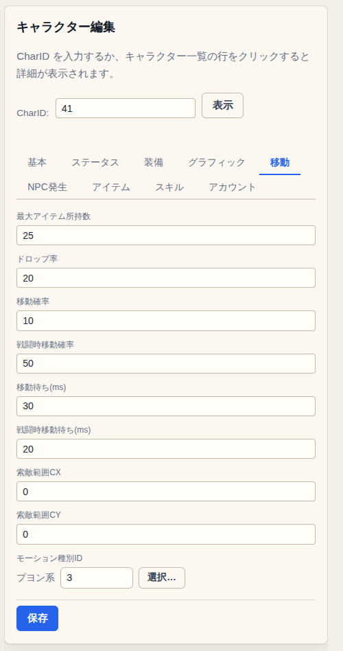
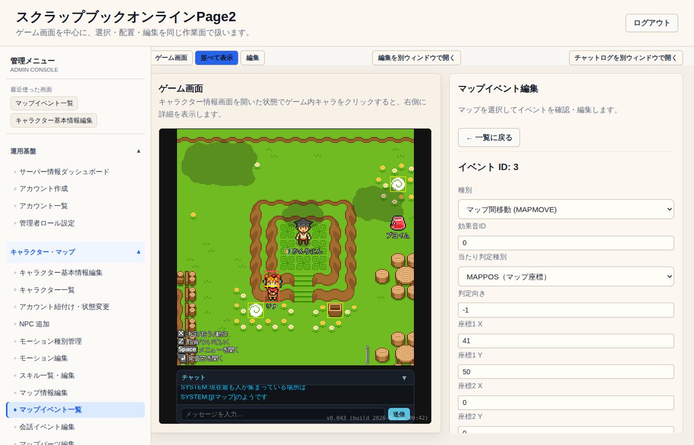
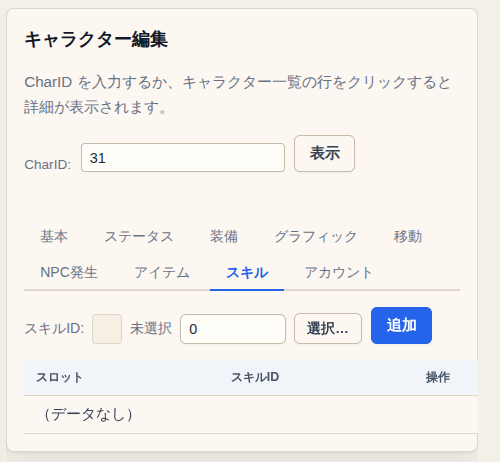
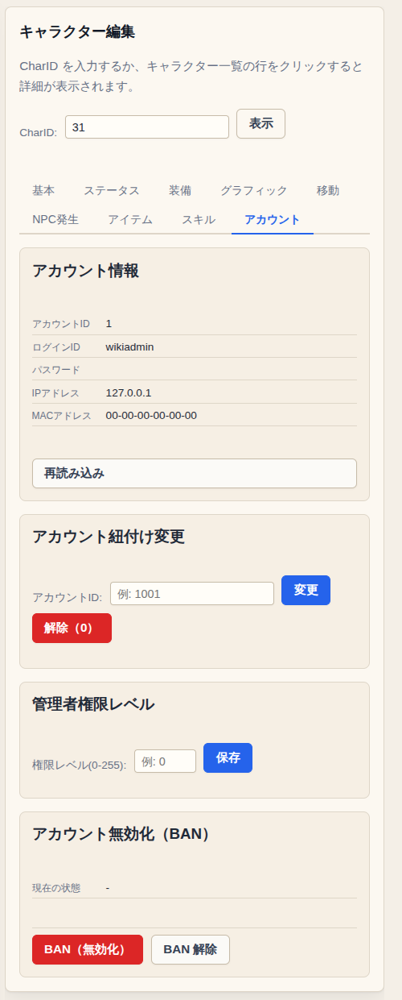

運営・管理者向けに、Web 管理画面でよく使う作業の手順をまとめたページです。

管理画面はまだ作っている途中なので、画面の見た目やボタンの名前が変わることがあります。

---

## 管理画面に入る

サーバーの URL の後ろに `/admin/` を付けて開き、管理者アカウントのログイン ID とパスワードでログインします。

管理者アカウントは、管理者権限レベルが付いたアカウントです。付け方は下の「アカウントの権限・BAN」を見てください。

## 画面の見方

- **左**: 管理メニュー。上の「最近使った画面」から、さっき開いた画面に戻れます。
- **まん中**: ゲーム画面。ふだん遊ぶときと同じようにログインして、管理者のキャラクターでゲームに入ります。
- **右**: 選んだメニューの編集画面。

上のボタンで表示を切り替えられます。

| ボタン | 内容 |
|---|---|
| ゲーム画面 | ゲーム画面だけを表示する |
| 並べて表示 | ゲーム画面と編集画面を横に並べる |
| 編集 | 編集画面だけを表示する |
| 編集を別ウィンドウで開く | 編集画面を別ウィンドウに出す（画面が広いとき向け） |
| チャットログを別ウィンドウで開く | ゲームのチャットを別ウィンドウで見る |

多くの画面は **ゲーム画面をクリックして場所やキャラクターを指定** できます。
「ゲーム画面でクリックして指定」ボタンを押してから、ゲーム画面の置きたいマスをクリックします。やめるときは Esc です。

---

## キャラクターを調べる・直す

1. 管理メニューの「キャラクター基本情報編集」を開きます。
2. ゲーム画面でキャラクターをクリックします（赤い枠が付きます）。
   CharID が分かっているときは、CharID を入れて「表示」でも開けます。
3. 右側にそのキャラクターの情報が出るので、タブを切り替えて直し、各タブの「保存」を押します。

上の画面は、βマップのリナをクリックしたところです。

| タブ | 主な内容 |
|---|---|
| 基本 | 名前、いるマップと座標、向き、移動種別、会話の文章 |
| ステータス | HP・SP・攻撃力などの能力値 |
| 装備 | 装備中のアイテム（「外す」で外せる） |
| グラフィック | 見た目（髪・目・服・NPC の画像） |
| 移動 | 動く確率・速さ、アイテムを落とす確率、敵を探す範囲 |
| NPC発生 | 敵を湧かせる設定（下の「敵が湧く場所を作る」） |
| アイテム | 持ち物。追加・装備・削除ができる |
| スキル | 覚えているスキル |
| アカウント | アカウントの情報、権限、BAN |

キャラクターを名前やマップで探したいときは「キャラクター一覧」を使います。

---

## アイテムを地面に置く

1. 管理メニューの「アイテム一覧」を開きます。
2. 一番上の「ゲーム画面に配置」で、「選択…」からアイテム種別を選びます。
3. 「クリックして配置」を押し、ゲーム画面の置きたいマスをクリックします。

「続けて配置」にチェックを入れると、Esc を押すまで何個でも置けます。
置いたアイテムは下の一覧に出るので、そこから位置を変えたり消したりできます。

## プレイヤーにアイテムを渡す・装備させる

1. 「キャラクター基本情報編集」でキャラクターを開き、「アイテム」タブを選びます。
2. 「選択…」でアイテムを選んで「追加」を押すと、バッグに入ります。
3. 装備させたいアイテムは「装備」を押します。外すときは「装備」タブの「外す」です。

---

## NPC を置く

1. 管理メニューの「NPC 追加」を開きます。
2. キャラ名と種族 ID を入れます。
3. 「ゲーム画面でクリックして指定」を押して、ゲーム画面の置きたい場所をクリックします（マップ ID と座標が入ります）。
4. 必要なら「詳細設定」で移動種別・見た目・当たり判定を決めて、「NPC を追加」を押します。

「テンプレート（既存NPC）」で今いる NPC を選ぶと、その NPC の見た目・種族・動き方をコピーできます。似た NPC を増やすときに便利です。

| 移動種別 | 動き |
|---|---|
| 1: STAND | その場から動かない（町の人など） |
| 9: BATTLE1 | 攻撃すると反撃してくる敵 |
| 8: PUTNPC | 敵を湧かせる発生地点（下の「敵が湧く場所を作る」） |
| 2: BALL / 3: SCORE | サッカーのボールとゴール |

置いた NPC は「キャラクター基本情報編集」で、あとから直したり動かしたりできます。

---

## 敵が湧く場所を作る

敵は「発生地点」のキャラクターから、まわりに少しずつ湧きます。湧いた敵は発生地点の設定（見た目・HP・持ち物など）をそのまま受け継ぎます。

1. 「NPC 追加」で、移動種別を **8: PUTNPC** にして、湧かせたい場所の中心に置きます。見た目や名前は、湧かせたい敵のものにします。
2. 「キャラクター基本情報編集」でその発生地点を開き、「NPC発生」タブを設定して「保存」します。

| 項目 | 内容 |
|---|---|
| 発生周期 | 何秒ごとに湧くか判定するか |
| 同時発生数 | 同時にいられる数の上限（0 だと湧かない） |
| 発生確率 | 判定のたびに湧く確率（%） |
| 発生範囲X / Y | 中心からどこまでの範囲に湧くか（1 で半マス） |
| 発生させる移動種別 | 湧いた敵の動き方。反撃する敵なら 9: BATTLE1 |

3. 落とすアイテムは「アイテム」タブで発生地点に持たせます。倒されると、この中から1つを落とします。
4. 落とす確率は「移動」タブの「ドロップ率」（%）です。

βマップのプヨン・プヨイム・キーは、この方法で作られています。設定の例として開いてみると分かりやすいです。

---

## ワープ（マップの出入り口）を作る

1. 管理メニューの「マップイベント一覧」を開きます。ゲーム画面では、いまのマップのイベントが黄色い枠で表示されます。
2. ゲーム画面で出入り口にしたいマスをクリックします。
   - そこにイベントがあれば、その内容が開きます。
   - 無ければ「ここに新規作成」が出るので押します。
3. 種別を「マップ間移動 (MAPMOVE)」にします。
4. 移動先は「ゲーム画面でクリックして指定」を押してから、移動先のマスをクリックすると入ります（別のマップに移動してからクリックしても大丈夫です）。
5. 保存します。

マップイベントには、ほかに次の種類があります。

| 種別 | 内容 |
|---|---|
| マップ内移動 (MOVE) | 同じマップの別の場所へ移動する |
| ゴミ箱 (TRASHBOX) | 向かってアイテムを置くと捨てられる |
| ステータス初期化 (INITSTATUS) | 乗るとステータスが最初の値に戻る |
| 一時画像設定 (GRPIDTMP) | 乗ると見た目を一時的に変える（更衣室と大浴場で使っています） |
| 灯り (LIGHT) | まわりを明るくする |

---

## スキルを付ける

スキルはまだ作っている途中の機能で、いまは管理者が付けたときだけ使えます。

1. 「キャラクター基本情報編集」でキャラクターを開き、「スキル」タブを選びます。
2. 「選択…」でスキルを選んで「追加」を押します。

スキルの中身（名前・使う SP・アイコンなど）は「スキル一覧・編集」で変えられます。

---

## アカウントの権限・BAN

「キャラクター基本情報編集」の「アカウント」タブで、そのキャラクターのアカウントを操作します。

- **管理者権限レベル**: 0 は一般プレイヤーです。1 以上にすると管理画面に入れるようになります。信頼できる人にだけ付けてください。
- **アカウント無効化（BAN）**: 「BAN（無効化）」でそのアカウントはログインできなくなります。「BAN 解除」で戻せます。

同じことは「アカウント紐付け・状態変更」画面でもできます。

---

## そのほかのメニュー

| メニュー | できること |
|---|---|
| サーバー情報ダッシュボード | サーバーの状態、接続中のプレイヤー |
| アカウント作成 / アカウント一覧 | 管理用アカウントの作成と一覧 |
| 管理者ロール設定 | 管理者ごとにできる操作を決める |
| マップ情報編集 | マップの名前・BGM・天気・戦闘できるか など |
| 会話イベント編集 | NPC に話しかけたときの会話と選択肢 |
| マップパーツ配置 / マップパーツ編集 | マップの地面や壁を描く、パーツの絵を直す |
| マップオブジェクト配置 | 木や家具などの配置物を置く |
| 自動生成マップ設定 | 自動で作るマップの設定 |
| アイテム種別一覧 / 武器一覧 | アイテムと武器の定義（名前・効果・見た目） |
| 初期ステータス設定 | 新しく作ったキャラクターの能力値と最初にいる場所 |
| モーション種別管理 / モーション編集 | キャラクターの動きのアニメーション |
| エフェクト一覧 / 噴出し一覧 | 攻撃のエフェクトや頭の上の吹き出し |
| 画像エディタ | ゲームの画像をブラウザで描き直す |
| 監査ログ（操作履歴） | 管理画面で誰が何を変えたか（サーバーを再起動すると消えます） |

「監査レポートダウンロード」と「フェイルバック手順」は、まだ中身がありません。
