Web 管理画面の全メニューについて、画面ごとに何ができるかをまとめたページです。
よく使う作業の手順は [[管理画面の使い方]] を見てください。

いまの状態をそのまま書いています。管理画面は作っている途中なので、画面が変わったらこのページも直します。
画像は編集画面（右側）だけを切り出しています。

**目次**

- 運用基盤: [サーバー情報ダッシュボード](#サーバー情報ダッシュボード) / [アカウント作成](#アカウント作成) / [アカウント一覧](#アカウント一覧) / [管理者ロール設定](#管理者ロール設定)
- キャラクター: [キャラクター基本情報編集](#キャラクター基本情報編集) / [キャラクター一覧](#キャラクター一覧) / [アカウント紐付け・状態変更](#アカウント紐付け状態変更) / [NPC 追加](#npc-追加) / [モーション種別管理](#モーション種別管理) / [モーション編集](#モーション編集) / [スキル一覧・編集](#スキル一覧編集)
- マップ: [マップ情報編集](#マップ情報編集) / [マップイベント一覧](#マップイベント一覧) / [会話イベント編集](#会話イベント編集) / [マップパーツ編集](#マップパーツ編集) / [マップパーツ配置](#マップパーツ配置) / [マップウィンドウ](#マップウィンドウ) / [マップ影カタログ編集](#マップ影カタログ編集) / [マップオブジェクト配置](#マップオブジェクト配置) / [自動生成マップ設定](#自動生成マップ設定)
- アイテム・エフェクト: [アイテム種別一覧](#アイテム種別一覧) / [アイテム一覧](#アイテム一覧) / [武器一覧](#武器一覧) / [噴出し一覧](#噴出し一覧) / [エフェクト一覧](#エフェクト一覧) / [画像エディタ](#画像エディタ)
- 監査・運用: [監査ログ（操作履歴）](#監査ログ操作履歴) / [まだ中身がない画面](#まだ中身がない画面)
- システム設定: [初期ステータス設定](#初期ステータス設定)

一覧と編集フォームが分かれている画面（スキル・アイテム種別・武器・エフェクトなど）は、どれも同じ使い方です。

- 左（上）の一覧から項目を選ぶと、編集フォームが開きます。
- 「+ 新規追加」で新しく作れます。
- 上の「保存」で保存、「削除」で削除、「← 戻る」で一覧に戻ります。
- 一覧の上の検索欄で、ID や名前で絞り込めます。

---

## 運用基盤

### サーバー情報ダッシュボード

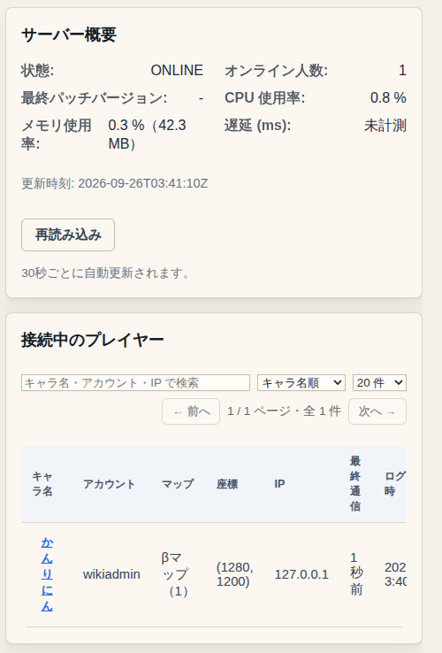

- サーバーの状態（オンラインか、接続人数、メモリ）を表示します。30 秒ごとに自動で更新されます。
- 「接続中のプレイヤー」に、いまログインしているキャラクター・マップ・座標・接続時間が出ます。

### アカウント作成

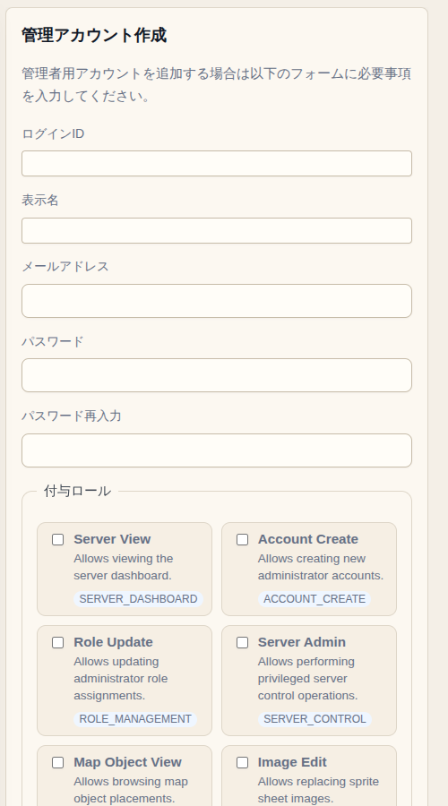

- 管理用のアカウントを作ります。ログイン ID・表示名・メールアドレス（任意）・パスワードを入れて、付けるロールを選びます。

### アカウント一覧

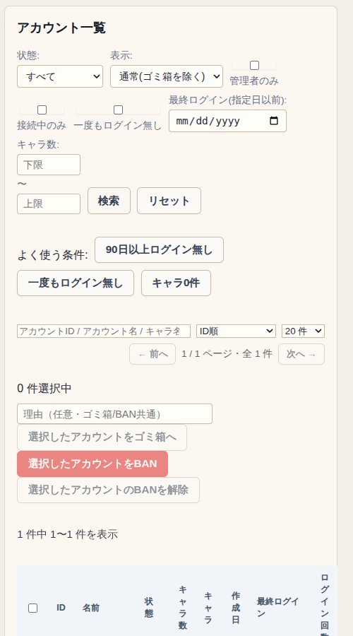

- すべてのアカウントを、状態（通常・BAN 中・ゴミ箱）、最終ログイン日、キャラ数などで絞り込んで表示します。
- 「90日以上ログイン無し」「一度もログイン無し」「キャラ0件」のボタンで、よく使う条件をすぐ選べます。
- チェックを入れたアカウントを、まとめてゴミ箱に入れたり、BAN したり、BAN を解除したりできます。
- 各アカウントの「コード再発行」で、ログインコードを出し直せます。前のコードとログイン中の端末は使えなくなります。新しいコードは一度しか表示されないので、その場で本人に伝えてください。

### 管理者ロール設定

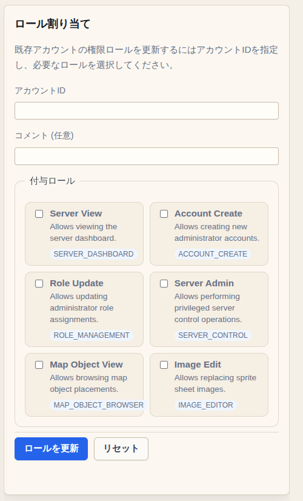

- 管理者アカウントごとに、できること（ロール）を選びます。
- いまのロールは次の6つです。「Server Admin」「Account Create」「Role Update」のどれかを付けると全権限の管理者になります。この画面では、全権限の管理者は1人だけにできます。

| ロール | できること |
|---|---|
| Server View | ダッシュボードを見る |
| Account Create | 管理用アカウントを作る |
| Role Update | ロールを変える |
| Server Admin | サーバーの操作 |
| Map Object View | マップの配置物を見る |
| Image Edit | 画像エディタで画像を差し替える |

---

## キャラクター

### キャラクター基本情報編集

キャラクターの情報をタブごとに編集します。使い方は [[管理画面の使い方]] の「キャラクターを調べる・直す」を見てください。

### キャラクター一覧

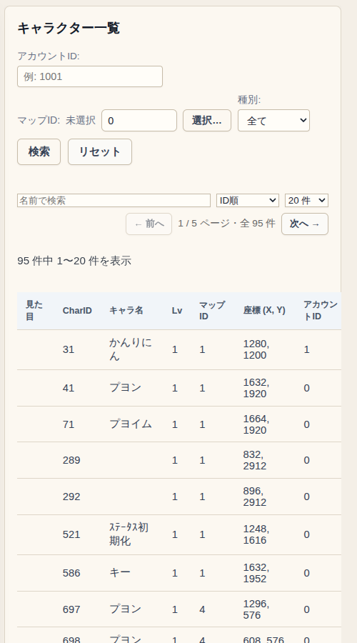

- キャラクターを、アカウント ID・マップ・種別（プレイヤー / NPC）・名前で検索します。
- 行をクリックすると「キャラクター基本情報編集」でそのキャラクターが開きます。

### アカウント紐付け・状態変更

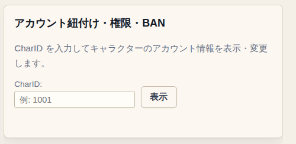

- CharID を入れて「表示」を押すと、そのキャラクターのアカウントについて、紐付けの変更、権限レベル、BAN / 解除ができます。
- 「キャラクター基本情報編集」の「アカウント」タブと同じ内容です。

### NPC 追加

NPC を1体置きます。使い方は [[管理画面の使い方]] の「NPC を置く」を見てください。

### モーション種別管理

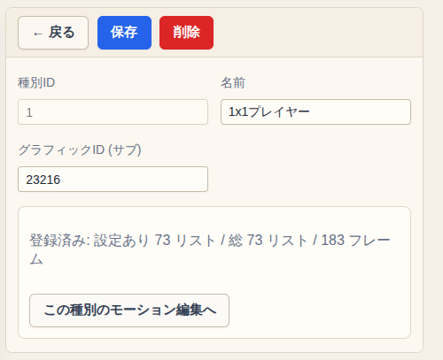

- キャラクターの動きのセット（モーション種別）を作ったり、名前を変えたりします。
- 「この種別のモーション編集へ」で、中身のモーション編集に移れます。

### モーション編集

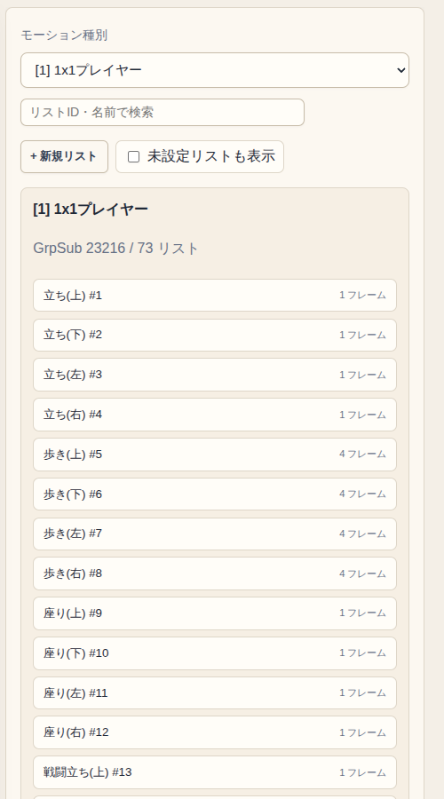

- モーション種別を選ぶと、その中の動き（歩く・攻撃する・座るなど、向きごと）が一覧で出ます。
- 動きを選ぶと、コマごとの画像の重ね方・待ち時間・効果音を編集でき、プレビューで確かめられます。

### スキル一覧・編集

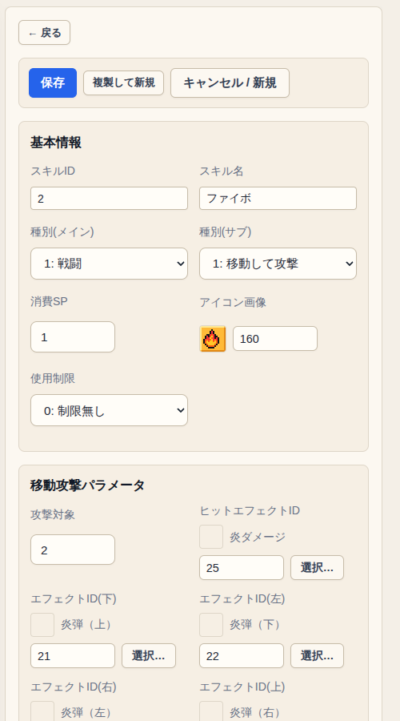

- スキルの名前・使う SP・アイコン・種類（戦闘 / 生活）を編集します。
- 戦闘スキルは、種類ごとの細かい設定（飛んでいく攻撃の距離や回復量など）もここで決めます。
- キャラクターにスキルを付けるのは「キャラクター基本情報編集」の「スキル」タブです。

---

## マップ

### マップ情報編集

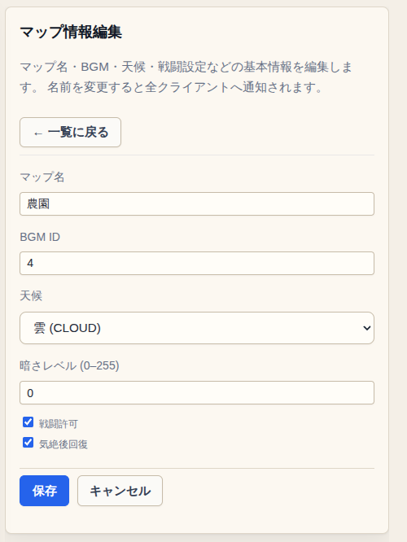

- マップの一覧から選んで、名前・BGM・天気・暗さ・戦闘できるか・気絶後に回復するか を変えます。
- 「マップ追加」で新しいマップを作れます（空のマップか、今あるマップのコピー）。
- 保存すると、遊んでいる人の画面にもすぐ反映されます。

### マップイベント一覧

ワープやゴミ箱などのマップイベントを作ります。使い方は [[管理画面の使い方]] の「ワープ（マップの出入り口）を作る」を見てください。

### 会話イベント編集

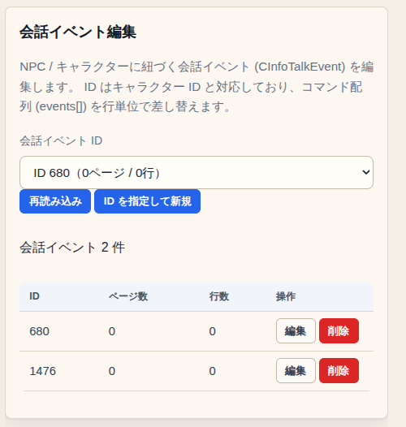

- NPC に話しかけたときの会話を作ります。会話イベントの ID は、NPC のキャラクター ID と同じ番号にします。
- 「編集」を押すと、会話の中身を行ごとに編集する画面が開きます。行の種類は、メッセージを出す・選択肢を出す・ページを切り替える・スキルを覚えさせる です。

### マップパーツ編集

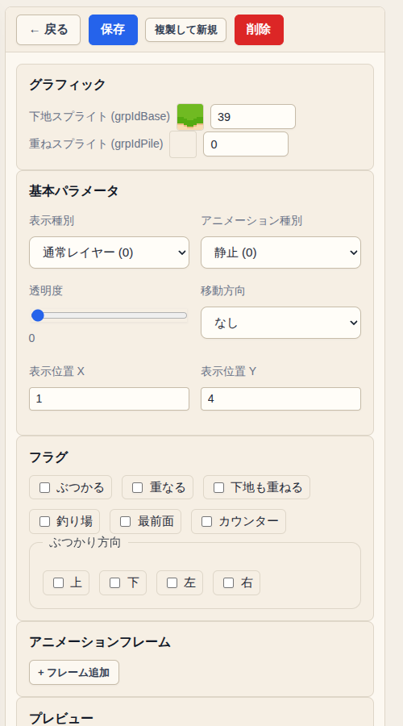

- マップの地面や壁の部品（パーツ）を一覧で表示します。パーツを選ぶと編集フォームが開きます。
- 画像（下の絵と上に重ねる絵）、アニメーション、通れるかどうか、どの向きから通れるか などを決めます。

### マップパーツ配置

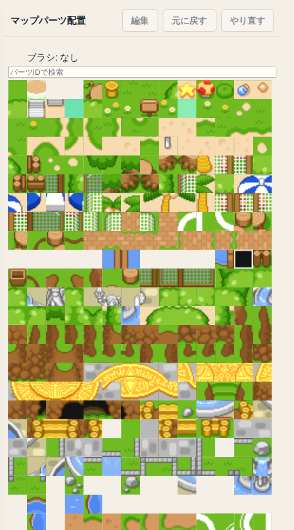

- パーツを選んでから、ゲーム画面のマスをクリックすると、そのパーツで塗れます。
- ゲーム画面で右クリックすると、そのマスのパーツを拾えます（スポイト）。
- 「元に戻す」「やり直す」で、塗った操作を取り消せます。
- 「編集」を押すと、選んだパーツの編集フォームがこの画面の中に開きます。

### マップウィンドウ

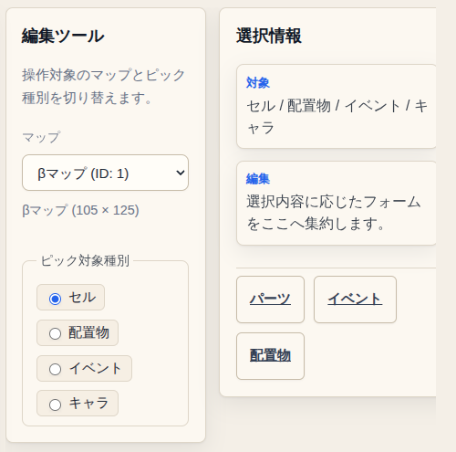

- ゲーム画面でクリックしたものを、ほかの編集画面へ渡すための画面です。
- 「ピック対象種別」で、クリックしたときに何を選ぶか（セル・配置物・イベント・キャラ）を切り替えます。
- 右の「パーツ」「イベント」「配置物」ボタンで、選んだものを編集する画面に移れます。

### マップ影カタログ編集

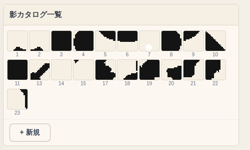

- マップに落とす影の部品を一覧で表示します。選ぶと画像やアニメーションを編集できます。

### マップオブジェクト配置

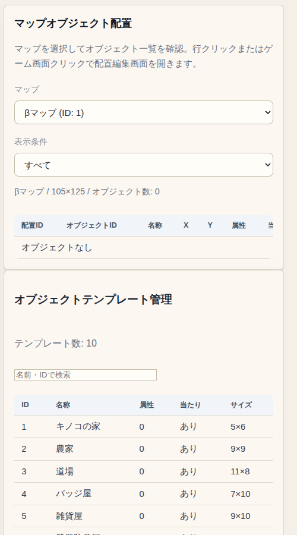

- 木・家具・看板のような配置物を置きます。マップを選ぶと、置いてある配置物の一覧が出ます。
- 一覧の行か、ゲーム画面をクリックすると、配置の編集画面が開きます。種類と座標を決めて「配置を保存」します。
- 下の「オブジェクトテンプレート管理」で、配置物の種類（名前・大きさ・当たり判定）を作れます。

### 自動生成マップ設定

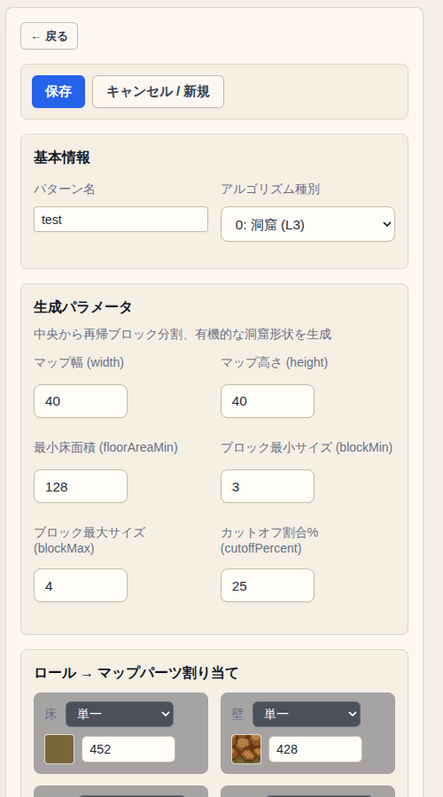

- 自動で作るマップ（ダンジョン）の作り方を設定します。まだ試している段階の機能です。
- 作り方は 洞窟・聖堂・地下墓地・地獄 の4種類から選び、大きさや部屋の数などを決めます。
- 壁・床・角などに、どのマップパーツを使うかも選べます。

---

## アイテム・エフェクト

### アイテム種別一覧

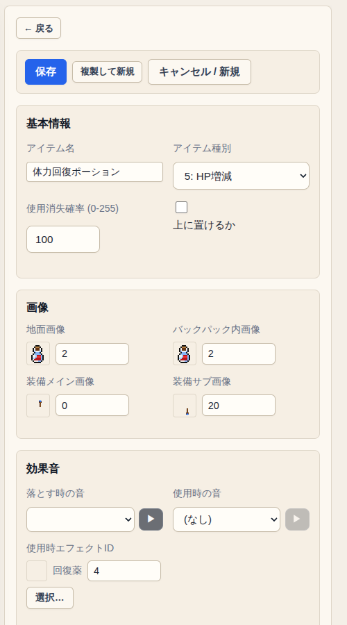

- アイテムの「種類」を作ります（名前・分類・効果・見た目・音）。
- 分類は 服・アクセサリ・持ち物・盾・HP 増減・灯り などです。回復アイテムは効果の最小値・最大値を決めます。
- 実際に地面やバッグにある1個1個のアイテムは「アイテム一覧」で扱います。

### アイテム一覧

地面やバッグにあるアイテムを1個ずつ扱います。使い方は [[管理画面の使い方]] の「アイテムを地面に置く」を見てください。

### 武器一覧

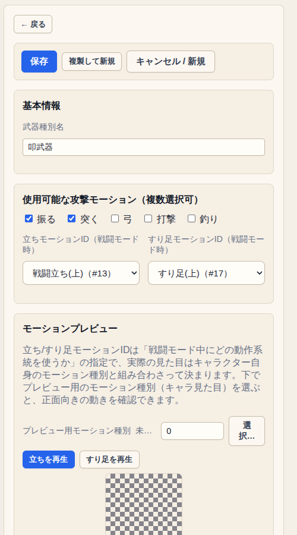

- 武器の種類（斬る武器・叩く武器・弓・釣りざおなど）ごとに、使える攻撃の動き（振る・突く・弓・打撃・釣り）、構えや歩き方のモーション、攻撃したときのエフェクトを決めます。
- アイテム種別の「武器情報 ID」で、どの武器の種類にするかを選びます。

### 噴出し一覧

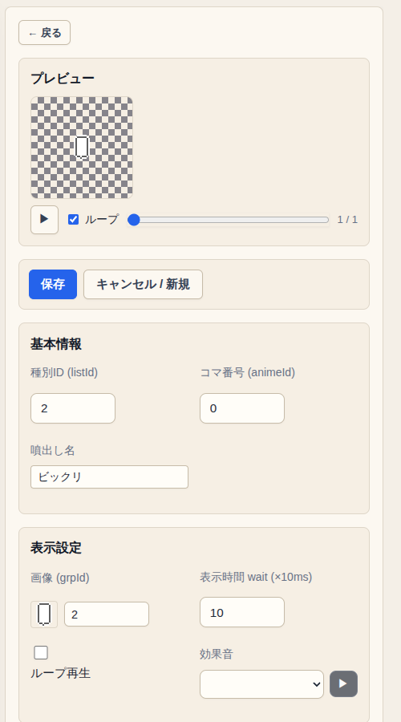

- キャラクターの頭の上に出る吹き出し（ビックリマークなど）のアニメーションを作ります。コマごとに画像と表示時間を決めます。

### エフェクト一覧

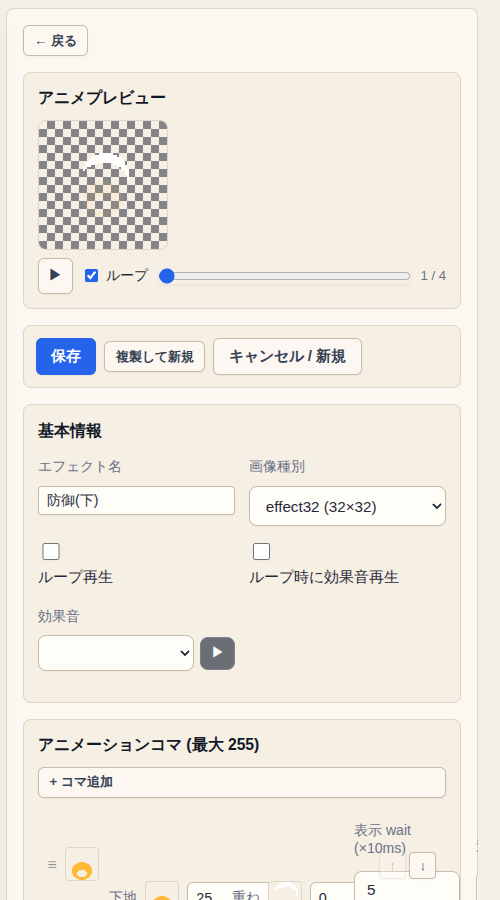

- 攻撃したときや防御したときなどのエフェクトを作ります。コマごとに画像・表示時間・透明度を決め、プレビューで再生できます。

### 画像エディタ

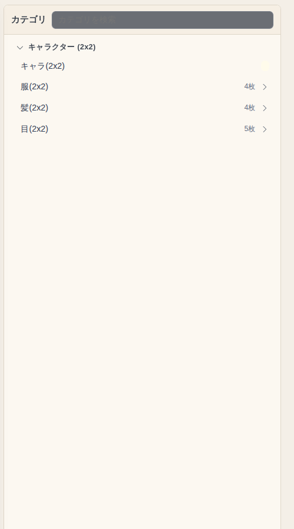

- ゲームで使う画像（キャラクター・服・髪・NPC・武器・マップパーツなど）を、種類ごとに表示します。
- 画像ファイルをアップロードして差し替えられます。差し替えた履歴から前の画像に戻したり、最初の画像に戻したりもできます。
- 差し替えた画像は、ゲームを読み込み直すと反映されます。

---

## 監査・運用

### 監査ログ（操作履歴）

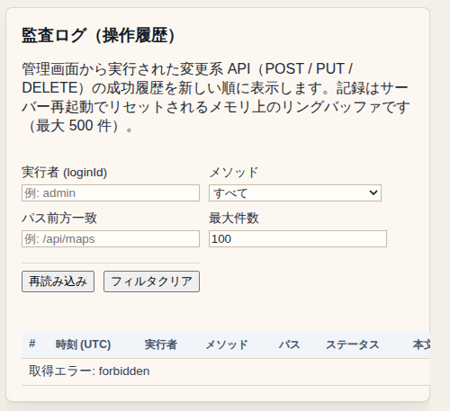

- 管理画面で行った変更（保存・追加・削除）の履歴です。操作した人・種類・対象で絞り込めます。
- サーバーを再起動すると消えます（最大 500 件）。

### まだ中身がない画面

「監査レポートダウンロード」と「フェイルバック手順」は、画面だけあって、まだ使える機能はありません。

---

## システム設定

### 初期ステータス設定

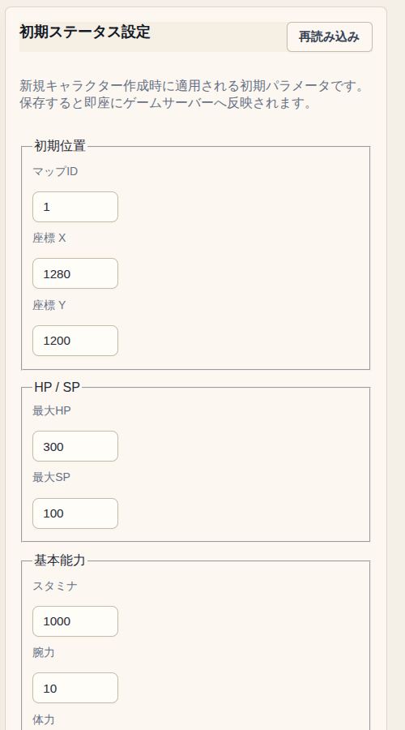

- 新しく作ったキャラクターの、最初にいるマップと座標、HP / SP、能力値を決めます。
- 変えても、すでにいるキャラクターの能力値はそのままです。βマップの「ステータス初期化」の場所に乗ったときは、この値に戻ります。
