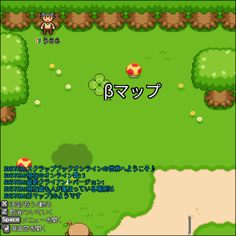
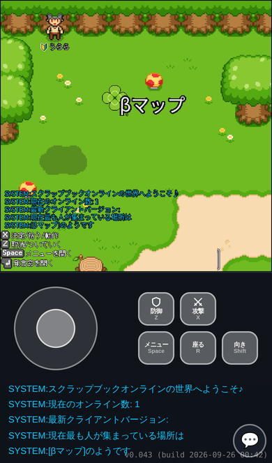
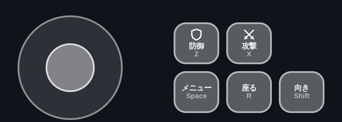
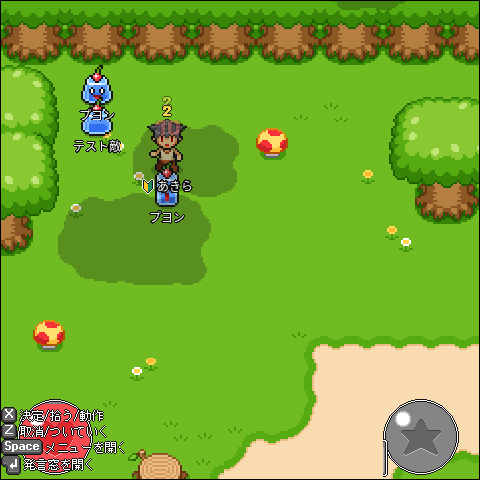
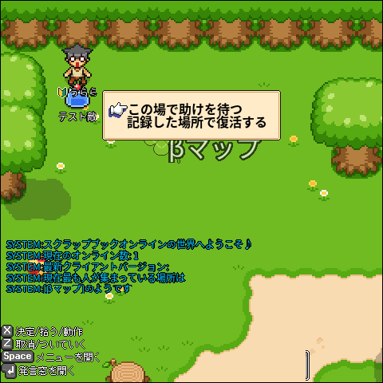
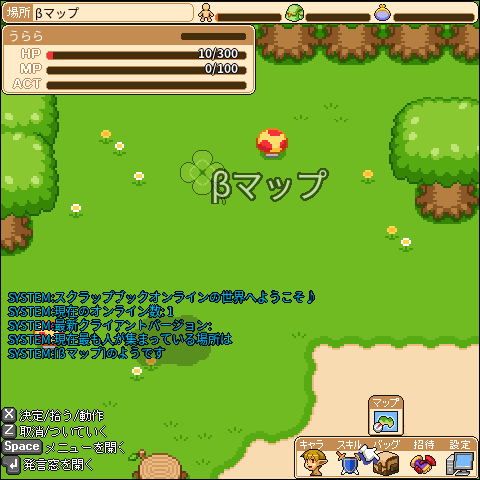
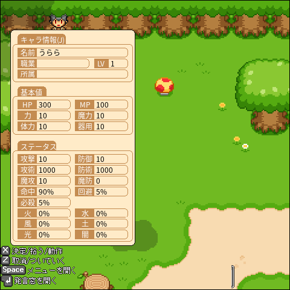
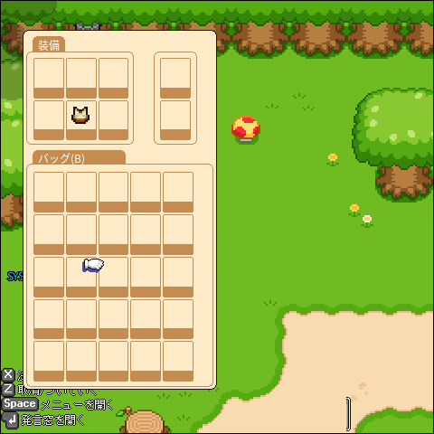
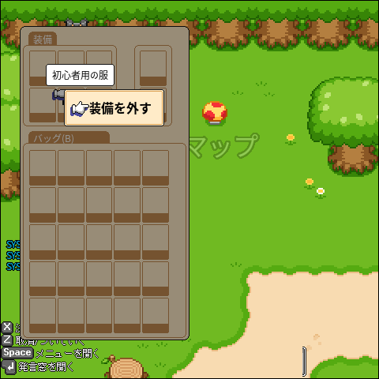
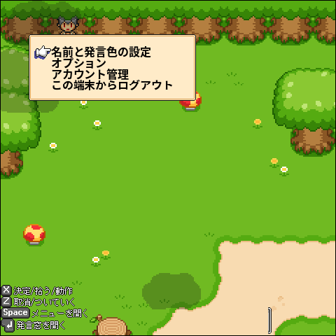

キャラクターを作ったあとの基本操作をまとめたページです。
アカウント登録からキャラクター作成までは [サーバー情報・遊び方](https://uraraworks.github.io/SBOP2/play.html) を見てください。

- 🎮 ブラウザで遊ぶ: https://sbop2.urara-works.jp/

---

## 操作方法

PC ではキーボード、スマホでは画面下のバーチャルパッドで遊びます。

| PC | スマホ（縦持ち） |
|---|---|
|  |  |

PC では画面の左下に、いま使えるキーの案内が出ます。

### 基本の操作

| やりたいこと | PC | スマホ |
|---|---|---|
| 歩く | ↑ ↓ ← →（2つ同時押しで斜め） | 左のスティック |
| 攻撃する・話しかける・拾う・釣る | X | 攻撃 / 決定 ボタン |
| 防御する | Z（押している間） | 防御 / 戻る ボタン |
| メニューを開く | Space | メニュー ボタン |
| 座る / 立つ | R | 座る ボタン |
| その場で向きだけ変える | Shift を押しながら ↑↓←→ | 向き ボタン（ON にしてからスティック） |
| チャットする | Enter | 💬 ボタン |

### X ボタンは「正面にあるもの」で動きが変わります

X（スマホでは攻撃 / 決定ボタン）を押すと、正面にあるものに合わせて自動で動作が決まります。優先順は次のとおりです。

1. 正面に敵がいる → 攻撃
2. 正面に話せる人がいる → 会話
3. 釣り竿を装備していて、正面が水辺 → 釣り
4. 足元にアイテムがある → 拾う
5. どれでもない → 空振り（戦闘できるマップのみ）

攻撃はボタンを押しっぱなしにすると連続で出ます。会話と釣りは、押し直した時だけ始まります。

### Z ボタン

- 戦闘できるマップでは、押している間ずっと防御します。
- 正面がほかのプレイヤーの場合は、その人に「付いて行く」をお願いします。

### スマホのボタン表示について

スマホのボタンは、状況に合わせて表示が変わります。

- 戦闘中でウィンドウが開いていない時: 「防御」「攻撃」
- 町にいる時やメニューを開いている時: 「戻る」「決定」

中身はどちらも同じボタンです（左が Z、右が X）。

「向き」ボタンは押すたびに ON / OFF が切り替わります。メニューを開くと自動で OFF に戻ります。

パッドは自動で表示されます。表示する・しないは、メニュー →「設定」→「オプション」→「入力設定」で変えられます。

---

## 戦闘

- 戦闘モードへの切り替え操作はありません。戦闘できるマップで攻撃すれば、そのまま戦闘が始まります。
- しばらく（約5秒）攻撃しないでいると、普段の状態に戻ります。
- 町など戦闘できないマップでは、攻撃も防御もできません。
- 釣り竿を装備している間は攻撃しません。戦う時は武器に持ち替えてください。

与えたダメージや受けたダメージは、キャラの頭の上に数字で出ます。

### 気絶したら

HP がなくなると気絶して、次のメニューが出ます。

- **この場で助けを待つ**
- **記録した場所で復活する**

気絶中に Space を押すと、このメニューをもう一度開けます。

---

## メニュー

Space でコマンドメニューを開きます。いま使える項目は次の4つです。

画面右下にアイコンが並びます。← → で選んで X で開きます。

| 項目 | 内容 | PC のショートカット |
|---|---|---|
| キャラ | ステータスを見る | J |
| スキル | 戦闘スキル / 生活スキル | F（戦闘）/ L（生活） |
| バッグ | 持っているアイテム | B |
| 設定 | システムメニュー（設定やログアウト） | Esc |

「招待」や、項目の上に出る「マップ」「パーティー」「ギルド」「ヘルプ」などはまだ準備中で、選んでも何も起きません。

メニューの中では X で決定、Z / Space で戻ります。

### ステータス

---

## アイテムと装備

- 足元に落ちているアイテムは X で拾えます。
- バッグ（B）でアイテムを選ぶと、次の操作ができます。
  - **使う**
  - **装備する** / **装備を外す**
  - **地面に置く**

| バッグ | アイテムを選んだところ |
|---|---|
|  |  |

上の段が装備中のアイテム、下の段がバッグの中身です。

---

## チャット

- PC は Enter、スマホは 💬 ボタンで入力欄が開きます。
- 名前と発言の色は、メニュー →「設定」→「名前と発言色の設定」で変えられます。

---

## システムメニュー

メニュー →「設定」（PC は Esc）で開きます。

- **名前と発言色の設定**
- **オプション**（表示設定・入力設定など）
- **アカウント管理**（新しいタブで開きます）
- **この端末からログアウト**

### 表示の切り替え（PC）

| キー | 内容 |
|---|---|
| N | キャラクター名の表示 / 非表示 |
| V | アイテム名の表示 / 非表示 |
| Ctrl | 画面が自キャラに付いてくる / 画面を固定する の切り替え |
| Shift + Ctrl | 視点を自キャラに戻す |

N と V はオプションの「表示設定」からも変えられます。
